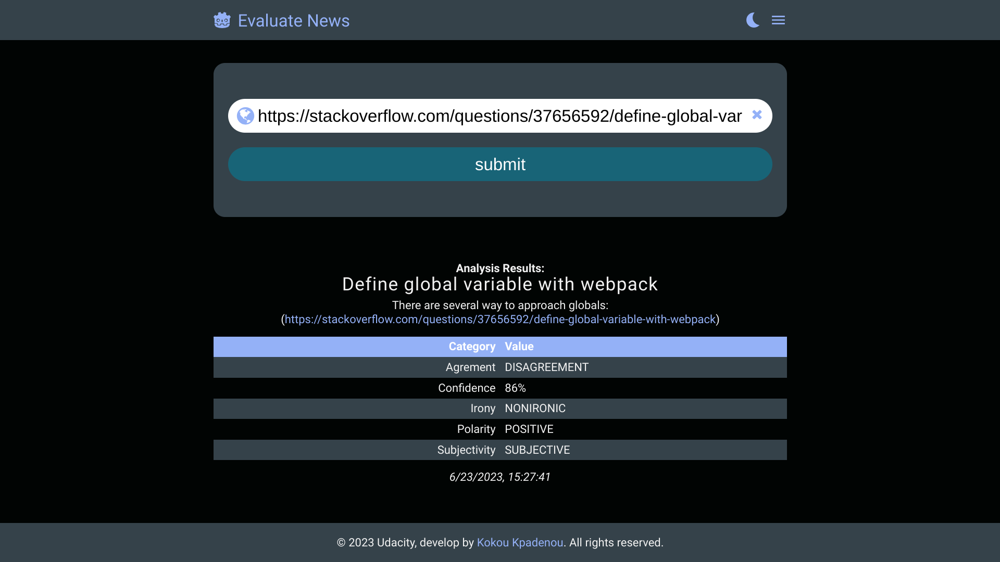

# Project: Evaluate News App

## Table of Contents

* [Summary](#summary)
* [Project description](#project-description)
* [Screenshots](#screenshots)
* [Project Structure](#project-structure)
* [Npm Commands Description](#npm-commands-description)
* [Usage](#usage)
* [Demo](#demo)
* [Deployment](#deployment)
* [Technologies used](#technologies-used)
* [Author](#author)
* [Credits](#credits)
* [Dependencies](#dependencies)

## Summary
The Evaluate News App is a web tool that utilizes Natural Language Processing (NLP) to analyze news articles or blogs found on other websites. The app aims to classify the content of the articles as subjective (opinion) or objective (fact-based) and determine the tone as positive, neutral, or negative.

To achieve this, the app makes use of the MeaningCloud Sentiment Analysis API, which provides NLP capabilities. The API allows the app to process and interpret natural human speech in text form. By leveraging machine learning and deep learning algorithms, the NLP system can understand the nuances and context of human language.

[Back to top](#table-of-contents)

## Project description

The project is built using various technologies and tools. It utilizes Node.js as the web server, Express as the web application framework for routing, and Webpack as the build tool for setting up development and production environments. The app also incorporates a Service Worker for offline functionality.

In the initial stages, the project focuses on setting up the development environment, including configuring Webpack, setting up Sass styles, and integrating necessary loaders and plugins. The layout and design of the web pages are created, and the app is prepared to handle API requests to MeaningCloud's Sentiment Analysis API.

The process of integrating the API involves signing up for an API key from MeaningCloud and implementing the necessary code to make successful API calls on form submission. API credentials are stored securely as environment variables to protect sensitive information. The API response is then parsed and dynamically displayed in the app's view.

As the project progresses, enhancements are made to meet the requirements outlined in the project rubric. The response from the API is further utilized to populate the content on the page dynamically.

The final stages of the project focus on implementing unit testing using the Jest framework. Tests are written to ensure the functionality of the app's custom JavaScript functions. The tests cover different scenarios and validate the expected outputs.

By completing the project, developers gain practical experience in setting up a development environment, integrating external APIs, handling API requests, dynamically displaying data, and implementing unit testing.

[Back to top](#table-of-contents)

## Screenshots

Here are some screenshots of the application in action:


*Main page displaying the main features of the application.*

Please note that the above screenshots are for illustrative purposes only and may not reflect the current state of the application.

[Back to top](#table-of-contents)

## Project Structure

| File/Folder             | Description                                |
|-------------------------|--------------------------------------------|
| .babelrc                | Babel configuration file                    |
| .editorconfig           | Editor configuration file                   |
| .eslintignore           | ESLint ignore file                          |
| .eslintrc.json          | ESLint configuration file                   |
| .gitignore              | Git ignore file                             |
| .node-version           | Node version file                           |
| .prettierignore         | Prettier ignore file                        |
| .prettierrc.json        | Prettier configuration file                 |
| README.md               | Readme file (you are here)                  |
| REQUIREMENTS.md         | Requirements document                      |
| __test__                | Test directory                              |
| package-lock.json       | NPM package lock file                       |
| package.json            | NPM package configuration file              |
| public                  | Public directory                            |
| src                     | Source code directory                       |
| &nbsp;&nbsp;└── client            | Client-side code directory                  |
|&nbsp;&nbsp;&nbsp;&nbsp;├── assets        | Assets directory                            |
|&nbsp;&nbsp;&nbsp;&nbsp;├── index.js      | Main client-side JavaScript file             |
|&nbsp;&nbsp;&nbsp;&nbsp;├── js            | JavaScript files directory                  |
|&nbsp;&nbsp;&nbsp;&nbsp;├── serviceWork.js| Service worker JavaScript file              |
|&nbsp;&nbsp;&nbsp;&nbsp;├── styles        | Styles directory                            |
|&nbsp;&nbsp;&nbsp;&nbsp;└── views         | Views directory                             |
|&nbsp;&nbsp;└── server            | Server-side code directory                  |
| webpack.common.js       | Webpack common configuration file           |
| webpack.dev.js          | Webpack development configuration file      |
| webpack.prod.js         | Webpack production configuration file       |


[Back to top](#table-of-contents)

## Npm Commands Description

- `"test": "jest"`: This command runs the test suite using Jest, a JavaScript testing framework. It executes any test files with the naming convention `*.test.js` or `*.spec.js` in the project and provides feedback on whether the tests pass or fail.

- `"start": "node src/server/index.js"`: This command starts the production server by executing the `index.js` file located in the `src/server` directory using Node.js. It launches the server and makes the web application available for users to access.

- `"dev": "node --watch src/server/index.js"`: This command starts the development server in watch mode. It uses Node.js to execute the `index.js` file in the `src/server` directory and automatically restarts the server whenever changes are detected in the file. This is useful during development as it allows for faster iteration and immediate feedback on code changes.

- `"build-prod": "webpack --config webpack.prod.js"`: This command triggers the production build process using Webpack. It runs the Webpack bundler with the specified configuration file (`webpack.prod.js`) to bundle and optimize the project's source code, assets, and dependencies for production deployment. The resulting optimized files are typically outputted to a `dist` or `build` directory.

- `"build-dev": "webpack-dev-server --config webpack.dev.js --open"`: This command starts the development server with live reloading using Webpack Dev Server. It runs the Webpack Dev Server with the specified configuration file (`webpack.dev.js`) to bundle the project's source code and assets. It also opens the application in a new browser tab for convenient development and automatically refreshes the page whenever changes are made to the code.

[Back to top](#table-of-contents)

## Usage

Follow the steps below to use this application:

1. **Clone the repository:**

```bash
git clone https://github.com/kokou2kpadenou/evaluate-news-nlp.git
```

2. **Navigate to the project directory:**

```bash
cd evaluate-news-nlp
```

3. **Install dependencies:**

```bash
npm install
```

4. **Set up environment variables:**

Create a `.env` file in the root directory and provide the necessary values for the variables. For example:
```plaintext
API_KEY=your-meaningcloud-api-key
```
Replace API_KEY with your actual MeaningCloud Sentiment API key.

5. **Start the server in Development:**

```bash
npm run dev
```

6. **Build the application for development:**

```bash
npm run build-dev
```

7. **Access the application:**
   
The application will open automatically on your default browser.
If not, open your web browser and visit http://localhost:8080 to access the application. If port 8080 is already used on your machine, check webpack-dev-server documentation to use a different port.

8. **Interact with the application:**

Explore and test the features of the application.

9. **Stop the server:**

When you're done, stop the server and the build by pressing Ctrl + C in their respective terminals.

[Back to top](#table-of-contents)

## Demo

You can see a live demo of this project at https://kkokou-evaluate-newa-nlp.onrender.com

[Back to top](#table-of-contents)

## Deployment

This project can be easily deployed using the Render deployment service integrated with GitHub. Render provides a simple and streamlined process for hosting and deploying web applications. Here's a step-by-step guide to deploying this project using Render and GitHub:

1. Sign up for a Render account at [render.com](https://render.com) if you haven't already.

2. Fork this project repository on GitHub to your own GitHub account.

3. On the Render dashboard, click on "Add a New Service" and select "Web Service".

4. Choose GitHub as the repository provider and grant Render the necessary permissions to access your repositories.

5. Select the repository that contains your forked project from the list.

6. Configure the deployment settings:
   - branch: main
   - Root Directory: (empty)
   - Runtime: node
   - Build Command: npm i && npm run build-prod
   - Start Command: npm start
   - Go to Advanced and set the environment variable
     - key: API_KEY
     - value: set to your MeaningCloud Sentiment API key

8. Choose the desired instance type, region, and other options for your deployment.

9. Click on "Create Web Service" to initiate the deployment process.

10. Render will automatically build and deploy your application based on the specified settings. You can monitor the deployment progress on the Render dashboard.

11. Once the deployment is complete, Render will provide you with a unique URL where your application is accessible.

Congratulations! Your application is now deployed using the Render deployment service with GitHub integration. Any changes you push to your GitHub repository will trigger automatic redeployment on Render, ensuring your deployed application is always up to date.


[Back to top](#table-of-contents)

## Technologies used
The project utilizes a variety of technologies and tools to accomplish its functionalities. The key technologies used in this project are:

- **Webpack**: Webpack is a popular module bundler and build tool used to compile and bundle the project's JavaScript, CSS, and other assets. It simplifies the development workflow by managing dependencies, optimizing assets, and providing a development server.

- **JavaScript**: The project extensively utilizes JavaScript as the primary programming language. It is used for both client-side and server-side development.

- **HTML**: HTML (Hypertext Markup Language) is used for creating the structure and content of web pages.

- **CSS**: Cascading Style Sheets (CSS) are used for styling web pages and providing visual aesthetics.

- **Progressive Web App (PWA)**: The project is built as a Progressive Web App, allowing users to install and use the application offline, receive push notifications, and enjoy an app-like experience on their devices.

- **MeaningCloud Sentiment Analysis API**: The MeaningCloud Sentiment Analysis API is used for analyzing the sentiment of text data in the application. It provides valuable insights into the emotional tone of the content.

- **Node.js**: Node.js is a JavaScript runtime environment that allows running JavaScript code outside the browser. It is used on the server-side to build the application's backend logic.

- **Express.js**: Express.js is a web application framework for Node.js. It is used to create the server-side endpoints and handle HTTP requests and responses.

- **Jest**: Jest is a JavaScript testing framework used for unit testing the application. It provides a simple and efficient way to write and run tests.

- **Git**: Git is a version control system that tracks changes in the source code during development. It enables collaboration, code management, and version control.

- **Render.com**: Render.com is a cloud platform used to deploy and host web applications. It simplifies the deployment process and ensures the application is accessible to users.

These technologies and tools work together to create a dynamic and interactive web application, enabling data retrieval, user input handling, and seamless integration with external APIs.


[Back to top](#table-of-contents)

## Author

This project was created by Kokou Kpadenou as part of the Udacity Frontend Developer Nanodegree through the Bertelsmann Next Generation Tech Booster Scholarship Program.

You can find more about Kokou Kpadenou on his [GitHub profile](https://www.github.com/kokou2kpadenou).

[Back to top](#table-of-contents)

## Credits

- Starter code provided by Udacity: 
- Icones used in the project were obtained from icomoon: https://icomoon.io
- The project was completed by Kokou Kpadenou as part of the Udacity Frontend Developer Nanodegree through the Bertelsmann Next Generation Tech Booster Scholarship Program.

[Back to top](#table-of-contents)

## Dependencies

This project utilizes various dependencies to support its functionality. The complete list of dependencies and their versions can be found in the `package.json` file. Here are the main dependencies used in this project:

- **express**: Fast, unopinionated, minimalist web framework for Node.js.
- **dotenv**: Module for loading environment variables from a .env file.
- **webpack**: Module bundler used for compiling and bundling the project's assets.
- **babel**: Compiler for JavaScript code, used for transpiling modern JavaScript to browser-compatible code.
- **jest**: JavaScript testing framework for unit testing the application.

For a complete list of dependencies and their versions, please refer to the `package.json` file in the root directory of this project.

To install all the necessary dependencies, run the following command:

```bash
npm install
```
This will fetch and install all the required dependencies based on the versions specified in the package.json file.


[Back to top](#table-of-contents)
